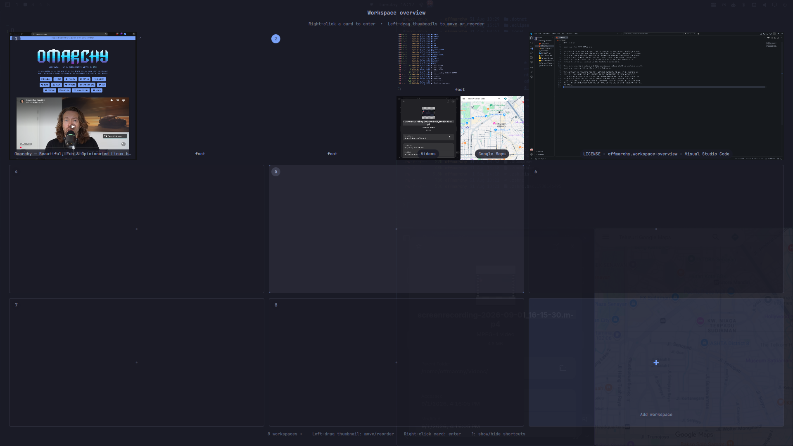

# Workspace Navigator

Workspace navigation panel for Omarchy Shell with live Hyprland window
thumbnails.

https://github.com/user-attachments/assets/05c1dcf1-332a-4b1e-b2d7-3017d8340ca5




## Features

- 3×3 workspace grid with horizontal pages.
- Live thumbnails showing each window's layout.
- Right-click a workspace to enter it.
- Drag windows between workspaces.
- Drag windows within a workspace to reorder them.
- Create and delete empty workspaces above workspace 8.
- Keyboard navigation with arrows, `H/J/K/L`, `Tab`, and `Enter`.

## Swipe settings

Open `Launcher → Setup → Workspace Navigator` to choose:

- `Kinetic`: a strong flick can move across multiple pages.
- `Single Page`: each flick moves only one page.

## Install

```bash
omarchy plugin add https://github.com/roubilibo/omarchy-workspace-navigator.git --enable --yes
```

### Bind with `SUPER+TAB`

1. Open the Hyprland bindings file:

   ```bash
   nano ~/.config/hypr/bindings.lua
   ```

2. Add the following lines. `hl.unbind` removes Omarchy's default `SUPER+TAB`
   action before assigning the shortcut to this plugin:

   ```lua
   hl.unbind("SUPER + TAB")
   o.bind("SUPER + TAB", "Workspace Navigator",
     "omarchy-shell shell toggle roubilibo.workspace-navigator")
   ```

3. Save the file and press `SUPER+TAB`. Hyprland normally reloads the binding
   automatically; if it does not, run `hyprctl reload`.

The plugin can also be opened directly without a keybinding:

```bash
omarchy-shell shell toggle roubilibo.workspace-navigator
```

Update an existing installation with:

```bash
omarchy plugin update roubilibo.workspace-navigator
```

To remove it:

```bash
omarchy plugin remove roubilibo.workspace-navigator --yes
```

The plugin uses compositor-backed previews only. It does not save screenshots,
access the network, or use privilege escalation. Omarchy plugins run as
unsandboxed code inside `omarchy-shell`; only install repositories you trust.

## License

MIT
